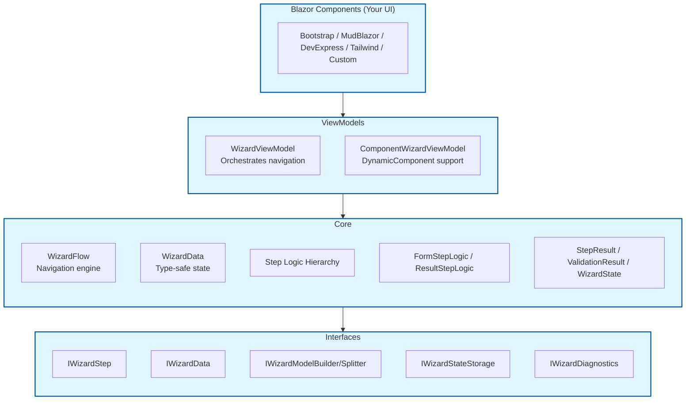
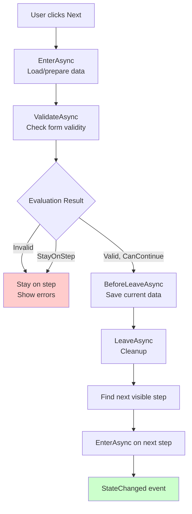
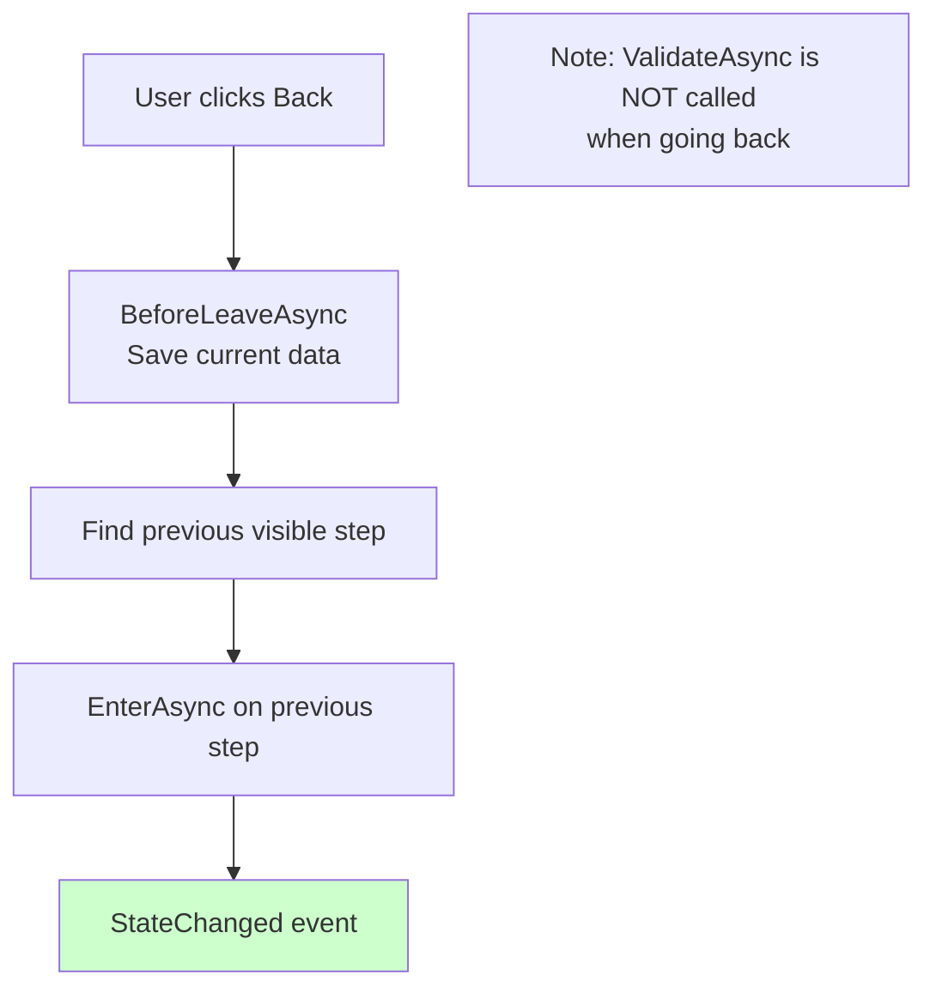

# Blazor.Wizard Developer Guide

A comprehensive technical reference covering architecture, components, design patterns, and usage guide for the Blazor.Wizard library.

## Table of Contents

1. [Overview](#overview)
2. [Solution Structure](#solution-structure)
3. [Architecture Layers](#architecture-layers)
4. [Core Components](#core-components)
5. [Interfaces](#interfaces)
6. [ViewModels](#viewmodels)
7. [Persistence](#persistence)
8. [Step Lifecycle](#step-lifecycle)
9. [Navigation Flow](#navigation-flow)
10. [Usage Patterns](#usage-patterns)

---

## Overview

Blazor.Wizard is a flexible, UI-agnostic wizard framework for Blazor applications. It provides step orchestration, validation, shared state management, and conditional navigation without prescribing any particular UI framework.

### Key Features

- **UI-Agnostic Core** - Works with Bootstrap, DevExpress, MudBlazor, Tailwind, or custom UI
- **Type-Safe State** - `WizardData<T>` provides type-safe data sharing between steps
- **Conditional Navigation** - `StepResult.NextStepId` enables dynamic routing based on business logic
- **Lifecycle Hooks** - `EnterAsync`, `ValidateAsync`, `BeforeLeaveAsync`, `LeaveAsync`
- **State Persistence** - Resume wizards after page refresh (SSR-safe)
- **Reusable Steps** - `FormStepLogic<TModel>`, `ResultStepLogic<TResultModel>`
- **Diagnostics** - `IWizardDiagnostics` for logging and monitoring

### Design Principles

| Principle | Description |
|-----------|-------------|
| **Separation of Concerns** | UI renders, logic controls behavior |
| **Flexibility** | Support minimal reusable-step setups and fully customized workflows |
| **Extensibility** | Override any part of the workflow |
| **Composability** | Mix and match reusable steps |
| **Testability** | Business logic isolated from Blazor components |

---

## Solution Structure

```
Blazor.Wizard/
├── Blazor.Wizard/                       # Main NuGet library
│   ├── Core/                            # Core wizard logic
│   ├── Interfaces/                      # Public contracts
│   ├── ViewModels/                      # UI integration
│   ├── Persistence/                     # State storage
│   ├── Extensions/                      # DI extensions
│   ├── Obsolete/                        # Deprecated code
│   └── wwwroot/                         # Static assets
├── Blazor.Wizard.Demo/                  # Demo app (Bootstrap UI)
├── Blazor.Wizard.DemoDexEx/             # Demo app (DevExpress UI)
├── Blazor.Wizard.Tests/                 # Unit tests for core library
└── Blazor.Wizard.Demo.Tests/            # Integration tests
```

### Project Dependencies

```
Blazor.Wizard.Demo
    └── Blazor.Wizard (NuGet package)

Blazor.Wizard.Tests
    └── Blazor.Wizard (NuGet package)
```

---

## Architecture Layers

Blazor.Wizard follows a layered architecture with clear separation of concerns:



### Layer Responsibilities

| Layer | Responsibility | Key Types |
|-------|---------------|-----------|
| **Components** | Render UI, handle user input | Razor components |
| **ViewModels** | Orchestrate navigation, manage lifecycle | `WizardViewModel`, `ComponentWizardViewModel` |
| **Core** | Business logic, navigation, state | `WizardFlow`, step logic classes, `WizardData` |
| **Interfaces** | Contracts for extensibility | All `IWizard*` interfaces |

---

## Core Components

This section provides detailed documentation for each core class.

### WizardFlow<TStep>

**Namespace:** `Blazor.Wizard.Core`

**Purpose:** Navigation engine that manages step progression, including Next, Previous, and Start operations.

**Key Responsibilities:**
- Maintain current step index
- Navigate between steps (skipping invisible steps)
- Trigger lifecycle events on navigation
- Support step adapters for custom behavior

**Type Signature:**
```csharp
public sealed class WizardFlow<TStep> where TStep : notnull
```

**Properties:**

| Property | Type | Description |
|----------|------|-------------|
| `Current` | `TStep` | Currently active step identifier |
| `Index` | `int` | Current step index (0-based) |
| `Data` | `IWizardData` | Reference to wizard data container |

**Events:**

| Event | Type | Description |
|-------|------|-------------|
| `StateChanged` | `Action` | Fired when wizard state changes |

**Methods:**

| Method | Signature | Description |
|--------|-----------|-------------|
| `Add` | `void Add(IWizardStep step)` | Adds a step to the flow |
| `StartAsync` | `Task StartAsync()` | Initializes wizard to first step |
| `NextAsync` | `Task NextAsync()` | Navigates to next visible step |
| `PrevAsync` | `Task PrevAsync()` | Navigates to previous visible step |
| `Register` | `void Register(TStep id, IFlowStepAdapter adapter)` | Registers adapter for a step |

**Navigation Logic:**
1. Check adapter permission (`CanLeaveAsync`)
2. Validate current step (`ValidateAsync`)
3. Execute `BeforeLeaveAsync`
4. Find next visible step (skip hidden steps)
5. Execute `OnEnterAsync` (adapter)
6. Execute `EnterAsync` (new step)
7. Fire `StateChanged`

---

### BaseStepLogic<TModel>

**Namespace:** `Blazor.Wizard.Core`

**Purpose:** Abstract base class for wizard steps. Provides core step functionality: model management, EditContext lifecycle, and wizard step interface implementation.

**Type Signature:**
```csharp
public abstract class BaseStepLogic<TModel> : IWizardStep
```

**Abstract Members:**

| Member | Signature | Description |
|--------|-----------|-------------|
| `Id` | `abstract Type Id { get; }` | Unique step identifier |
| `Evaluate` | `abstract StepResult Evaluate(IWizardData data, ValidationResult validation)` | Business logic evaluation |

**Virtual Members:**

| Member | Default Behavior | Override For |
|--------|------------------|--------------|
| `IsVisible` | `true` | Conditional step visibility |
| `EnterAsync` | Load/create model in data | Custom initialization |
| `BeforeLeaveAsync` | Save model to data | Pre-leave logic |
| `LeaveAsync` | No-op | Cleanup |
| `ValidateAsync` | Validate via EditContext | Custom validation |
| `GetComponentParameters` | Return Model + EditContext | Custom parameters |

**Properties:**

| Property | Type | Description |
|----------|------|-------------|
| `Id` | `Type` | Unique step identifier |
| `IsVisible` | `bool` | Step visibility in navigation |
| `Logger` | `ILogger?` | Optional logger instance |

**Protected Properties:**

| Property | Type | Description |
|----------|------|-------------|
| `_context` | `EditContext` | Blazor's edit context for the model |
| `_model` | `TModel` | The data model for this step |

**Constructor Options:**

```csharp
// Default: uses parameterless constructor
public class MyStep : BaseStepLogic<MyModel> { }

// Custom factory
public class MyStep : BaseStepLogic<MyModel>(() => new MyModel { Name = "Default" }) { }
```

**Key Methods:**

```csharp
// Get the EditContext for data binding
public EditContext GetEditContext()

// Get the model instance
public TModel GetModel()

// Lifecycle: called when entering step
public virtual ValueTask EnterAsync(IWizardData data)
{
    if (data.TryGet<TModel>(out var existing))
    {
        _model = existing!;
        _context = new EditContext(_model);
    }
    else
    {
        data.Set(_model);
    }
    return ValueTask.CompletedTask;
}

// Lifecycle: called before leaving step
public virtual ValueTask BeforeLeaveAsync(IWizardData data)
{
    data.Set(_model);  // Save current model state
    return ValueTask.CompletedTask;
}

// Lifecycle: validate step data
public virtual ValueTask<bool> ValidateAsync(IWizardData data)
{
    var isValid = _context.Validate();
    return ValueTask.FromResult(isValid);
}
```

---

### GeneralStepLogic<TModel>

**Namespace:** `Blazor.Wizard.Core`

**Purpose:** Extends `BaseStepLogic<TModel>` with validation message handling capabilities. Use as the base for steps requiring field-level validation and error management.

**Type Signature:**
```csharp
public abstract class GeneralStepLogic<TModel> : BaseStepLogic<TModel>
```

**Additional Members:**

| Member | Type | Description |
|--------|------|-------------|
| `ValidationMessageStore` | `ValidationMessageStore?` | Store for custom validation messages |

**Helper Methods:**

| Method | Description |
|--------|-------------|
| `AddValidationError` | Add field-level validation error |
| `ClearValidation` | Clear validation for a field |
| `EnsureValidationMessageStore` | Initialize message store if needed |
| `NotifyValidation` | Trigger validation state notification |

**Usage Example:**

```csharp
public class PersonStepLogic : GeneralStepLogic<PersonModel>
{
    public override Type Id => typeof(PersonStepLogic);

    public override StepResult Evaluate(IWizardData data, ValidationResult validation)
    {
        var model = GetModel();
        
        // Custom validation: age must be reasonable
        if (model.Age < 0 || model.Age > 150)
        {
            var context = GetEditContext();
            EnsureValidationMessageStore(context);
            AddValidationError(context, nameof(model.Age), "Age must be between 0 and 150.");
            return new StepResult { StayOnStep = true };
        }

        return new StepResult { CanContinue = true };
    }
}
```

---

### FormStepLogic<TModel>

**Namespace:** `Blazor.Wizard.Core`

**Purpose:** Reusable form step that validates via EditContext/DataAnnotations and proceeds when valid. Use for simple form-based steps without custom logic.

**Type Signature:**
```csharp
public sealed class FormStepLogic<TModel> : BaseStepLogic<TModel>
```

**Key Behavior:**

| Scenario | Result |
|----------|--------|
| Validation fails | `StepResult { StayOnStep = true }` |
| Validation passes | `StepResult { CanContinue = true }` |

**Usage:**

```csharp
// Define model with DataAnnotations
public class ContactModel
{
    [Required]
    [EmailAddress]
    public string Email { get; set; } = string.Empty;
    
    [Required]
    [Phone]
    public string Phone { get; set; } = string.Empty;
}

// Create step using FormStepLogic
var contactStep = new FormStepLogic<ContactModel>(typeof(ContactModel));
```

**Equivalent Custom Implementation:**

```csharp
public sealed class ContactStepLogic : BaseStepLogic<ContactModel>
{
    public override Type Id => typeof(ContactStepLogic);

    public override StepResult Evaluate(IWizardData data, ValidationResult validation)
    {
        if (!validation.IsValid)
            return new StepResult { StayOnStep = true };
        return new StepResult { CanContinue = true };
    }
}
```

---

### ResultStepLogic<TResultModel>

**Namespace:** `Blazor.Wizard.Core`

**Purpose:** Reusable summary/final step that builds a result model and always allows completion. Use as the final step to display summary and build the result.

**Type Signature:**
```csharp
public sealed class ResultStepLogic<TResultModel> : IWizardStep
```

**Key Behavior:**

| Method | Behavior |
|--------|----------|
| `ValidateAsync` | Always returns `true` (no validation needed) |
| `Evaluate` | Always returns `CanContinue = true` |
| `EnterAsync` | Builds result model using provided builder function |

**Usage:**

```csharp
// Define result model
public class PersonResult
{
    public string Name { get; set; } = string.Empty;
    public int Age { get; set; }
    public string Address { get; set; } = string.Empty;
}

// Create result step with builder function
var resultStep = new ResultStepLogic<PersonResult>(
    id: typeof(PersonResult),
    resultBuilder: data =>
    {
        var person = data.Get<PersonModel>();
        var address = data.Get<AddressModel>();
        
        return new PersonResult
        {
            Name = person.Name,
            Age = person.Age,
            Address = address.FullAddress
        };
    }
);
```

---

### WizardData

**Namespace:** `Blazor.Wizard.Core`

**Purpose:** Type-safe container for wizard data. Stores models by type and provides get/set operations.

**Type Signature:**
```csharp
public sealed class WizardData : IPersistableWizardData, IWizardContext
```

**Methods:**

| Method | Signature | Description |
|--------|-----------|-------------|
| `Set<T>` | `void Set<T>(T value)` | Store a model by its type |
| `Set` | `void Set(object value)` | Store a model (type inferred) |
| `Get<T>` | `T Get<T>()` | Retrieve model (throws if not found) |
| `TryGet<T>` | `bool TryGet<T>(out T? value)` | Retrieve model safely |
| `GetAllData` | `Dictionary<Type, object> GetAllData()` | Get all stored data |
| `LoadData` | `void LoadData(Dictionary<Type, object> data)` | Load data from persistence |

**Usage:**

```csharp
var data = new WizardData();

// Store models
data.Set(new PersonModel { Name = "John", Age = 30 });
data.Set(new AddressModel { City = "NYC" });

// Retrieve models
var person = data.Get<PersonModel>();  // Throws if not found

// Safe retrieval
if (data.TryGet<PersonModel>(out var person2))
{
    Console.WriteLine(person2.Name);
}

// Access all data for serialization
var allData = data.GetAllData();
```

---

### WizardState

**Namespace:** `Blazor.Wizard.Core`

**Purpose:** Serializable representation of wizard state for persistence.

**Type Signature:**
```csharp
public sealed class WizardState
```

**Properties:**

| Property | Type | Description |
|----------|------|-------------|
| `CurrentStepIndex` | `int` | Current step index |
| `SerializedData` | `Dictionary<string, string>` | Serialized models (type name → JSON) |
| `SavedAt` | `DateTime` | Timestamp when state was saved |

**Serialization Format:**

```json
{
  "CurrentStepIndex": 2,
  "SerializedData": {
    "PersonModel": "{ \"Name\": \"John\", \"Age\": 30 }",
    "AddressModel": "{ \"City\": \"NYC\" }"
  },
  "SavedAt": "2024-01-15T10:30:00Z"
}
```

---

### StepResult

**Namespace:** `Blazor.Wizard.Core`

**Purpose:** Represents the result of a wizard step evaluation, controlling navigation and flow.

**Type Signature:**
```csharp
public sealed class StepResult
```

**Properties:**

| Property | Type | Default | Description |
|----------|------|---------|-------------|
| `CanContinue` | `bool` | `false` | Whether wizard can proceed |
| `NextStepId` | `Type?` | `null` | Specific next step (null = default) |
| `StayOnStep` | `bool` | `false` | Force stay on current step |

**Usage Examples:**

```csharp
// Default: proceed to next step
return new StepResult { CanContinue = true };

// Block progression
return new StepResult { StayOnStep = true };

// Conditional navigation
if (model.Age < 18)
    return new StepResult { NextStepId = typeof(GuardianConsentStep) };
    
return new StepResult { CanContinue = true };

// Combined: block and stay
return new StepResult { CanContinue = false, StayOnStep = true };
```

---

### ValidationResult

**Namespace:** `Blazor.Wizard.Core`

**Purpose:** Carries validation state and error messages.

**Type Signature:**
```csharp
public sealed class ValidationResult
```

**Properties:**

| Property | Type | Description |
|----------|------|-------------|
| `IsValid` | `bool` | Overall validation status |
| `ErrorMessage` | `string?` | Single error message |
| `Errors` | `IEnumerable<string>` | Collection of error messages |

**Factory Method:**

```csharp
// Create valid result
ValidationResult.Valid()
```

---

## Interfaces

### IWizardStep

**Namespace:** `Blazor.Wizard.Interfaces`

**Purpose:** Main interface for wizard steps. Defines lifecycle methods, evaluation, validation, and navigation support.

**Members:**

| Member | Type | Description |
|--------|------|-------------|
| `Id` | `Type` | Unique step identifier |
| `IsVisible` | `bool` | Step visibility in navigation |
| `EnterAsync` | `ValueTask` | Called when entering step |
| `Evaluate` | `StepResult` | Business logic evaluation |
| `BeforeLeaveAsync` | `ValueTask` | Called before leaving |
| `LeaveAsync` | `ValueTask` | Called when leaving |
| `ValidateAsync` | `ValueTask<bool>` | Validate step data |
| `GetComponentParameters` | `Dictionary<string, object>` | UI parameters |

---

### IWizardData

**Namespace:** `Blazor.Wizard.Interfaces`

**Purpose:** Contract for wizard data container.

**Members:**

| Member | Signature |
|--------|-----------|
| `Set<T>` | `void Set<T>(T value)` |
| `TryGet<T>` | `bool TryGet<T>(out T? value)` |

---

### IWizardModelBuilder<TResult>

**Namespace:** `Blazor.Wizard.Interfaces`

**Purpose:** Builds final result from wizard data at completion.

```csharp
public interface IWizardModelBuilder<out TResult>
{
    TResult Build(IWizardData data);
}
```

**Usage:**

```csharp
public class PersonModelBuilder : IWizardModelBuilder<PersonResult>
{
    public PersonResult Build(IWizardData data)
    {
        var person = data.Get<PersonModel>();
        var address = data.Get<AddressModel>();
        
        return new PersonResult
        {
            Name = person.Name,
            Address = address.FullAddress
        };
    }
}
```

---

### IWizardModelSplitter<TResult>

**Namespace:** `Blazor.Wizard.Interfaces`

**Purpose:** Splits existing result into wizard data for prefilling (edit mode).

```csharp
public interface IWizardModelSplitter<in TResult>
{
    void Split(TResult result, IWizardData data);
}
```

**Usage:**

```csharp
public class PersonModelSplitter : IWizardModelSplitter<PersonResult>
{
    public void Split(PersonResult result, IWizardData data)
    {
        data.Set(new PersonModel { Name = result.Name, Age = result.Age });
        data.Set(new AddressModel { City = result.City });
    }
}

// Edit mode:
modelSplitter.Split(existingPerson, viewModel.Data);
await viewModel.StartAsync();
```

---

### IWizardStateStorage

**Namespace:** `Blazor.Wizard.Interfaces`

**Purpose:** Defines storage operations for wizard state persistence.

```csharp
public interface IWizardStateStorage
{
    Task SaveAsync(string key, string state, CancellationToken ct = default);
    Task<string?> LoadAsync(string key, CancellationToken ct = default);
    Task RemoveAsync(string key, CancellationToken ct = default);
}
```

---

### IWizardDiagnostics

**Namespace:** `Blazor.Wizard.Interfaces`

**Purpose:** Hook for logging and monitoring wizard events.

```csharp
public interface IWizardDiagnostics
{
    void WizardStarted(string firstStepName);
    void StepEntered(string stepName);
    void StepCompleted(string stepName);
    void ValidationExecuted(string stepName, bool isValid);
    void WizardCompleted(string finalStepName);
    void TransitionBlocked(string stepName, string reason);
}
```

---

### IFlowStepAdapter

**Namespace:** `Blazor.Wizard.Interfaces`

**Purpose:** Adapter for custom step behavior during navigation.

```csharp
public interface IFlowStepAdapter
{
    ValueTask OnEnterAsync();
    ValueTask<bool> CanLeaveAsync();
}
```

---

## ViewModels

### WizardViewModel<TStep, TData, TResult>

**Namespace:** `Blazor.Wizard.ViewModels`

**Purpose:** Base view model for wizard orchestration. Manages step navigation, validation, and result building.

**Type Parameters:**
- `TStep` - Step type (must implement `IWizardStep`)
- `TData` - Data container (must implement `IWizardData`)
- `TResult` - Result type (class)

**Properties:**

| Property | Type | Description |
|----------|------|-------------|
| `Data` | `TData` | Wizard data container |
| `Flow` | `WizardFlow<int>?` | Navigation flow |
| `Steps` | `List<TStep>` | All wizard steps |
| `CanProceed` | `bool` | Whether Next is enabled |
| `ModelBuilder` | `IWizardModelBuilder<TResult>` | Result builder |
| `ModelSplitter` | `IWizardModelSplitter<TResult>` | Data prefiller |
| `StepFactory` | `WizardStepFactory` | Step factory |

**Methods:**

| Method | Description |
|--------|-------------|
| `Initialize` | Initialize steps from factories |
| `StartAsync` | Start wizard from first step |
| `NextAsync` | Navigate to next step |
| `BackAsync` | Navigate to previous step |
| `FinishAsync` | Complete wizard and build result |
| `Reset` | Reset wizard state |

**Events:**

| Event | Type | Description |
|-------|------|-------------|
| `StateChanged` | `Action` | Fired when wizard state changes |

---

### ComponentWizardViewModel<TResult>

**Namespace:** `Blazor.Wizard.ViewModels`

**Purpose:** Enhanced view model for DynamicComponent-based hosts. Provides component type resolution and simplified step factory.

**Type Parameter:** `TResult` - Result type (class)

**Extends:** `WizardViewModel<IWizardStep, WizardData, TResult>`

**Key Properties:**

| Property | Type | Description |
|----------|------|-------------|
| `CurrentStep` | `IWizardStep?` | Current wizard step |
| `CurrentComponentType` | `Type?` | Component to render |
| `CurrentComponentParameters` | `Dictionary<string, object>?` | Component parameters |
| `CanGoBack` | `bool` | Whether back navigation available |
| `HasNextVisibleStep` | `bool` | Whether forward navigation available |

**Abstract Members:**

```csharp
// Map step to component type
protected abstract Type ResolveComponentType(IWizardStep step);

// Provide default step factories
protected abstract IReadOnlyList<Func<IWizardStep>> GetDefaultStepFactories();
```

---

## Persistence

### MemoryWizardStateStorage

**Namespace:** `Blazor.Wizard.Persistence`

**Purpose:** In-memory state storage. SSR-safe but loses data on server restart.

**Use Case:** Development, testing, short-lived wizards.

```csharp
// Registration
services.AddScoped<MemoryWizardStateStorage>();
services.AddWizardPersistence<MemoryWizardStateStorage>();
```

---

### ProtectedLocalStorageWizardStateStorage

**Namespace:** `Blazor.Wizard.Persistence`

**Purpose:** Browser localStorage persistence via Blazor's ProtectedLocalStorage.

**Use Case:** Client-side persistence (requires interactivity).

```csharp
// Registration (requires IJSRuntime)
services.AddScoped<ProtectedLocalStorageWizardStateStorage>();
services.AddWizardPersistence<ProtectedLocalStorageWizardStateStorage>();
```

---

### HybridWizardStateStorage

**Namespace:** `Blazor.Wizard.Persistence`

**Purpose:** Combines memory and browser storage. Works during SSR (memory) and upgrades to browser storage when available.

**Use Case:** **Recommended for production** - handles both server and client scenarios.

```csharp
// Registration
services.AddWizardPersistence<HybridWizardStateStorage>();
// Automatically configures memory + browser storage
```

// Automatically configures memory + browser storage
```

---

## Step Lifecycle

### Forward Navigation (Next)

When user clicks **Next**:



### Backward Navigation (Prev)

When user clicks **Back**:



### Lifecycle Methods

| Method | Called | Typical Use |
|--------|--------|-------------|
| `EnterAsync` | When step becomes active | Load data, initialize UI |
| `ValidateAsync` | Before navigation | Form validation (DataAnnotations) |
| `Evaluate` | After validation | Business logic, conditional navigation |
| `BeforeLeaveAsync` | Before leaving step | Pre-leave validation, save draft |
| `LeaveAsync` | After leaving step | Cleanup, analytics |

### Detailed Flow

```csharp
// NextAsync flow:
public async Task<bool> NextAsync()
{
    // 1. BeforeLeaveAsync - Save current state
    await step.BeforeLeaveAsync(_data);
    
    // 2. ValidateAsync - Check form validity
    var isValid = await step.ValidateAsync(_data);
    if (!isValid) return false;
    
    // 3. Evaluate - Business logic
    var stepResult = step.Evaluate(_data, validation);
    
    // 4. Check if can proceed
    var canProceed = isValid && stepResult.CanContinue && !stepResult.StayOnStep;
    
    if (canProceed)
    {
        // 5. LeaveAsync - Cleanup
        await step.LeaveAsync(_data);
        
        // 6. Find next step
        var nextIndex = FindNextStepIndex(stepResult.NextStepId);
        
        // 7. EnterAsync - Initialize next step
        await Steps[nextIndex].EnterAsync(_data);
    }
    
    return canProceed;
}

// BackAsync flow:
public async Task BackAsync()
{
    if (Flow.Index <= 0) return;

    var currentStep = Steps[Flow.Index];
    
    // 1. Check adapter permission
    if (Current is not null && _stepAdapters.TryGetValue(Current, out var leaveAdapter))
    {
        if (!await leaveAdapter.CanLeaveAsync()) return;
    }
    
    // 2. BeforeLeaveAsync - Save current state
    await currentStep.BeforeLeaveAsync(_data);
    
    // 3. Find previous visible step (skip hidden steps)
    var prevIndex = Flow.Index - 1;
    while (prevIndex >= 0 && !Steps[prevIndex].IsVisible) prevIndex--;
    
    if (prevIndex >= 0)
    {
        Flow.Index = prevIndex;
        
        // 4. Notify adapter
        var prevStepId = GetStepId(Steps[prevIndex]);
        if (_stepAdapters.TryGetValue(prevStepId, out var prevAdapter))
        {
            await prevAdapter.OnEnterAsync();
        }
        
        // 5. EnterAsync - Initialize previous step (NO validation!)
        await Steps[prevIndex].EnterAsync(_data);
    }
    
    StateChanged?.Invoke();
}
```

---

## Navigation Flow

### Step Visibility

Steps can be conditionally hidden using the `IsVisible` property:

```csharp
public class AgeStepLogic : GeneralStepLogic<AgeModel>
{
    public override Type Id => typeof(AgeStepLogic);

    public override bool IsVisible
    {
        get
        {
            // Only show if user selected "Adult" in previous step
            _data.TryGet<SelectionModel>(out var selection);
            return selection?.Type == "Adult";
        }
    }
}
```

The `WizardFlow` automatically skips invisible steps during navigation.

### Conditional Routing

Use `StepResult.NextStepId` for dynamic navigation:

```csharp
public override StepResult Evaluate(IWizardData data, ValidationResult validation)
{
    var model = GetModel();
    
    if (model.Age < 16)
    {
        // Skip adult steps
        return new StepResult { NextStepId = typeof(TeenStep) };
    }
    else if (model.Age >= 65)
    {
        // Senior-specific flow
        return new StepResult { NextStepId = typeof(SeniorStep) };
    }
    
    return new StepResult { CanContinue = true };
}
```

---

## Usage Patterns

### Pattern 1: Simple Form Wizard

Use `FormStepLogic` for straightforward forms without custom logic.

```csharp
// Models
public class ContactModel
{
    [Required] public string Email { get; set; } = "";
    [Required] public string Phone { get; set; } = "";
}

public class SurveyModel
{
    [Required] public int Rating { get; set; }
    public string? Comments { get; set; }
}

public class SurveyResult
{
    public string Email { get; set; } = "";
    public int Rating { get; set; }
}

// Result builder
public class SurveyMapper : IWizardModelBuilder<SurveyResult>
{
    public SurveyResult Build(IWizardData data)
    {
        var contact = data.Get<ContactModel>();
        var survey = data.Get<SurveyModel>();
        
        return new SurveyResult
        {
            Email = contact.Email,
            Rating = survey.Rating
        };
    }
}

// ViewModel
public class SurveyViewModel : ComponentWizardViewModel<SurveyResult>
{
    public SurveyViewModel(IWizardModelBuilder<SurveyResult> mapper) 
        : base(mapper) { }

    protected override Type ResolveComponentType(IWizardStep step)
    {
        return step.Id switch
        {
            var id when id == typeof(ContactModel) => typeof(ContactStep),
            var id when id == typeof(SurveyModel) => typeof(SurveyStep),
            var id when id == typeof(SurveyResult) => typeof(SummaryStep),
            _ => throw new InvalidOperationException()
        };
    }

    protected override IReadOnlyList<Func<IWizardStep>> GetDefaultStepFactories()
    {
        return
        [
            () => new FormStepLogic<ContactModel>(typeof(ContactModel)),
            () => new FormStepLogic<SurveyModel>(typeof(SurveyModel)),
            () => new ResultStepLogic<SurveyResult>(typeof(SurveyResult), 
                data => ModelBuilder.Build(data))
        ];
    }
}
```

### Pattern 2: Custom Step Logic

Implement custom evaluation for complex business rules.

```csharp
public class IncomeStepLogic : GeneralStepLogic<IncomeModel>
{
    public override Type Id => typeof(IncomeStepLogic);

    public override StepResult Evaluate(IWizardData data, ValidationResult validation)
    {
        var model = GetModel();
        
        // Custom validation: income must support loan amount
        if (data.TryGet<LoanModel>(out var loan) && model.AnnualIncome < loan.Amount / 4)
        {
            return new StepResult 
            { 
                StayOnStep = true,
                // Could set custom error message
            };
        }
        
        // Conditional routing based on income
        if (model.AnnualIncome > 100000)
        {
            return new StepResult { NextStepId = typeof(PremiumOptionsStep) };
        }
        
        return new StepResult { CanContinue = true };
    }
}
```

### Pattern 3: Edit Mode (Prefill Data)

Use `IWizardModelSplitter` to prefill wizard from existing data.

```csharp
// Mapper with both builder and splitter
public class PersonMapper : IWizardModelBuilder<PersonResult>, IWizardModelSplitter<PersonResult>
{
    // Build result from wizard data
    public PersonResult Build(IWizardData data)
    {
        return new PersonResult
        {
            Name = data.Get<PersonModel>().Name,
            City = data.Get<AddressModel>().City
        };
    }
    
    // Split result into wizard data (for editing)
    public void Split(PersonResult result, IWizardData data)
    {
        data.Set(new PersonModel { Name = result.Name });
        data.Set(new AddressModel { City = result.City });
    }
}

// Usage: Edit existing person
var mapper = new PersonMapper();
var viewModel = new PersonViewModel(mapper);

// Prefill with existing data
mapper.Split(existingPerson, viewModel.Data);
await viewModel.StartAsync();
```

### Pattern 4: Diagnostics and Logging

Implement `IWizardDiagnostics` to track wizard usage.

```csharp
public class WizardDiagnostics : IWizardDiagnostics
{
    private readonly ILogger<WizardDiagnostics> _logger;

    public WizardDiagnostics(ILogger<WizardDiagnostics> logger)
    {
        _logger = logger;
    }

    public void WizardStarted(string firstStepName)
        => _logger.LogInformation("Wizard started at {Step}", firstStepName);

    public void StepEntered(string stepName)
        => _logger.LogDebug("Entered step {Step}", stepName);

    public void StepCompleted(string stepName)
        => _logger.LogDebug("Completed step {Step}", stepName);

    public void ValidationExecuted(string stepName, bool isValid)
        => _logger.LogDebug("Validation for {Step}: {Result}", stepName, isValid);

    public void WizardCompleted(string finalStepName)
        => _logger.LogInformation("Wizard completed after {Step}", finalStepName);

    public void TransitionBlocked(string stepName, string reason)
        => _logger.LogWarning("Transition blocked at {Step}: {Reason}", stepName, reason);
}
```

---

## Quick Reference

### Namespace Imports

```csharp
using Blazor.Wizard.Core;
using Blazor.Wizard.Interfaces;
using Blazor.Wizard.ViewModels;
using Blazor.Wizard.Persistence;  // If using persistence
```

### Class Hierarchy

```
IWizardStep
    └── BaseStepLogic<TModel>
            └── GeneralStepLogic<TModel> (recommended base)
                    └── [Your Custom Step Logic]

FormStepLogic<TModel> (pre-built reusable)
ResultStepLogic<TResultModel> (pre-built reusable)
```

### Common Tasks

| Task | Solution |
|------|----------|
| Create simple form step | `new FormStepLogic<MyModel>(typeof(MyModel))` |
| Create custom logic | Inherit `GeneralStepLogic<TModel>` |
| Navigate conditionally | Return `new StepResult { NextStepId = typeof(NextStep) }` |
| Hide step conditionally | Override `IsVisible` property |
| Build final result | Implement `IWizardModelBuilder<T>` |
| Prefill wizard data | Implement `IWizardModelSplitter<T>` |
| Add persistence | Use `HybridWizardStateStorage` |
| Track wizard events | Implement `IWizardDiagnostics` |

---

*Document Version: 1.0*  
*Generated for: Blazor.Wizard Library*
